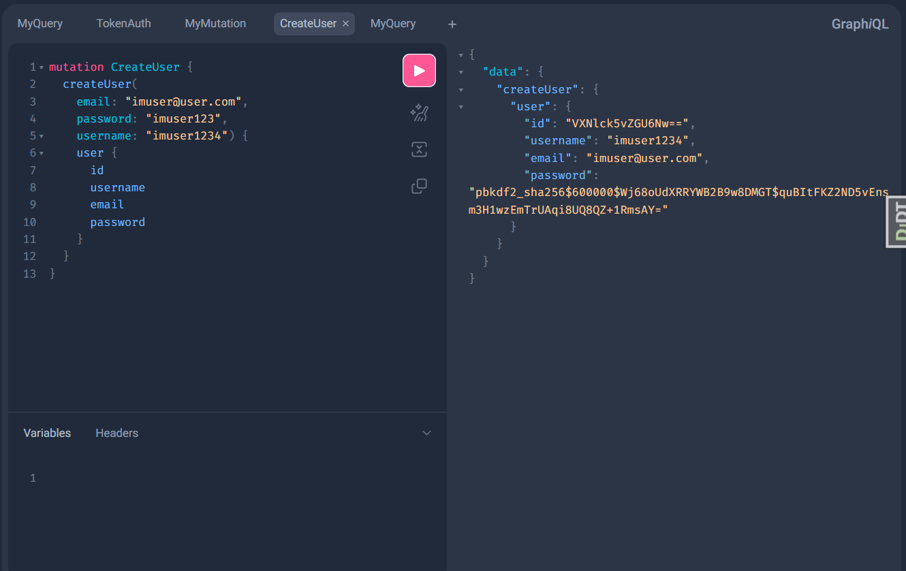
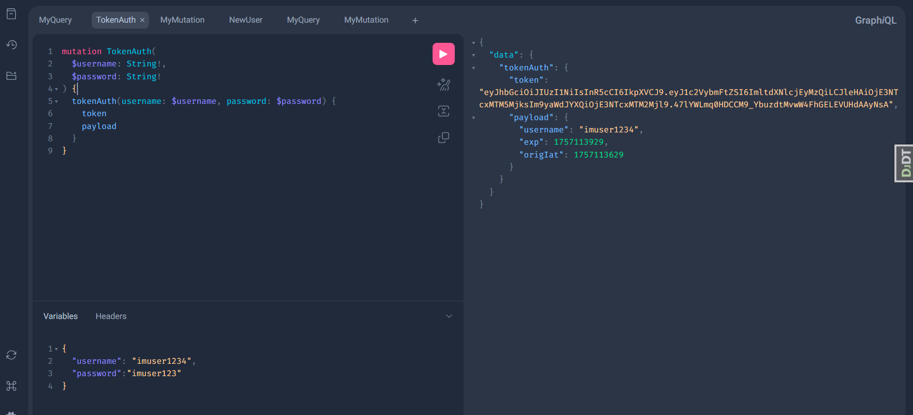
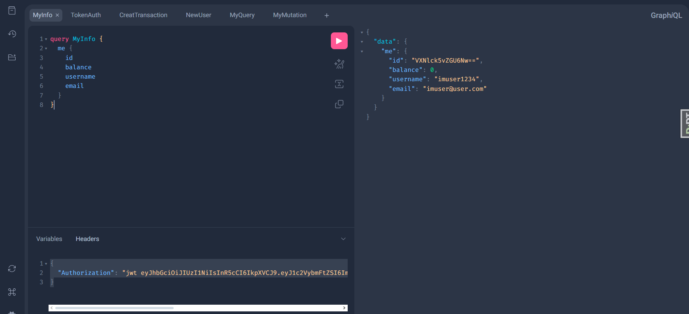
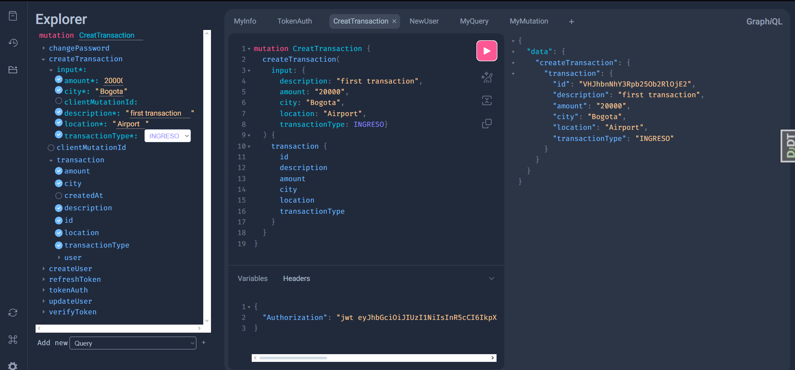
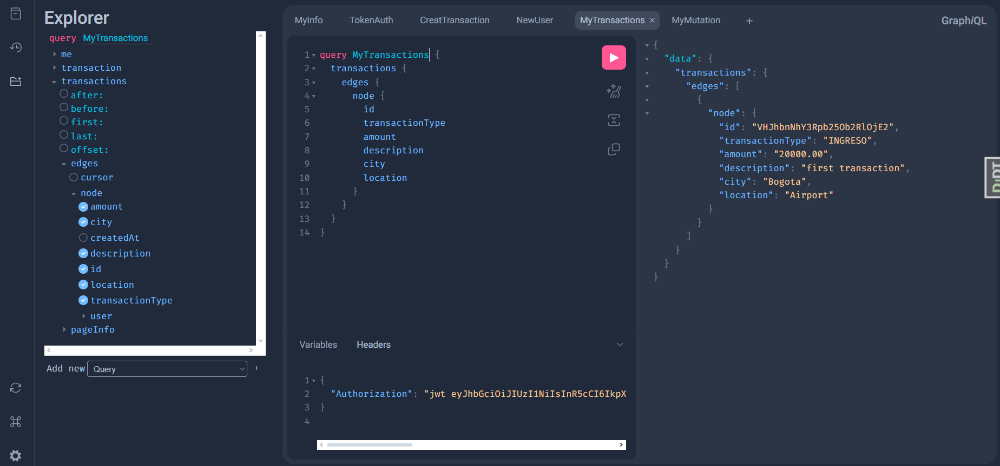

# 🔗 ISJ-API

ISJ-API (Inventory of Stella and Jorge - API) es la primera API que desarrollo, creada como parte del proyecto Inventory-Software-Journal (ISJ)

    Este backend está hecho en Django + GraphQL y permite gestionar usuarios y
    transacciones personales (ingresos y egresos).

👉 El frontend que acompaña a esta API está disponible aquí: ISJ Frontend

🚀 **Tecnologías**

- Django

- Graphene-Django (GraphQL)

- Django REST Framework (uso parcial)

- GraphQL-JWT (autenticación con JSON Web Tokens)

- SQLite (base de datos por defecto)

---
# ⚠️ ADVERTENCIA IMPORTANTE

**USAR ÚNICAMENTE LA RAMA `main`**

Este proyecto debe ejecutarse exclusivamente desde la rama `main`. Otras ramas pueden contener código experimental o inestable.

## Instalación correcta:

```bash
  git clone [URL_DEL_REPO]
  cd [NOMBRE_DEL_PROYECTO]
  git checkout main  # Asegúrate de estar en main
```
---
## ⚙️ Instalación y configuración

1. Clona este repositorio:

    ```bash
      git clone https://github.com/Pininita/ISJ-API.git
      cd ISJ-API
    ```


2. Crea y activa un entorno virtual, luego instala dependencias:

    ```bash
      pip install -r requirements.txt
    ```


3. Configura las variables de entorno en un archivo .env en la raíz:

    ```env
      SECRET_KEY=django-insecure-my-secure-key
      DEBUG=True
      ALLOWED_HOSTS=localhost,127.0.0.1
   ```


  ⚠️ **Puedes usar cualquier SECRET_KEY en local. 
  Solo asegúrate de cambiarla si lo deployas en producción.**

4. Aplica migraciones:

    ```bash
      python manage.py migrate
    ```


5. Ejecuta el servidor:

    ```bash
      python manage.py runserver
    ```


La API estará disponible en:
👉 http://127.0.0.1:8000/graphql/

### ✨ **Funcionalidades:**

  ✅ Registro de usuarios. 

  ✅ Autenticación con JWT (login y refresh de token). 

  ✅ Creación de transacciones (ingresos y egresos).

  ✅ Consulta de transacciones propias (cada usuario solo ve las suyas).

  ✅ Filtros por tipo, fecha y usuario.


📸 Ejemplos de uso
🔑 1. Registro de usuario
```
  mutation NewUser {
  createUser(
    email: "test@test.com"
    username: "tester"
    password: "123456"
  ) {
    user {
      id
      username
      email
    }
  }
}
```



🔑 2. Login con JWT

```
 mutation TokenAuth(
  $username: String!, 
  $password: String!
) {
tokenAuth(username: $username, password: $password) {
  token
  payload
  }
}
```

**variables to send**:
```
{
  "username": "imuser1234",
  "password":"imuser123"
}
```
### Copiamos el token que nos dan



👨‍💻 3. Verifica la informacion

```
query MyInfo {
  me {
    id
    balance
    username
    email
  }
}
```

**Headers to send**:

```
{
  "Authorization": "jwt (pega tu token aqui)"
}
```



💵 4. Crear transacción

```
mutation CreatTransaction {
  createTransaction(
    input: {
      description: "first transaction", 
      amount: "20000", 
      city: "Bogota", 
      location: "Airport", 
      transactionType: INGRESO}
  ) {
    transaction {
      id
      description
      amount
      city
      location
      transactionType
    }
  }
}
```
**Headers to send**:

```
{
  "Authorization": "jwt (pega tu token aqui)"
}
```



📊 5 . Consultar historial

```
query MyTransactions {
  transactions {
    edges {
      node {
        id
        transactionType
        amount
        description
        city
        location
      }
    }
  }
}
```
**Headers to send**:
```
{
  "Authorization": "jwt (pega tu token aqui)"
}
```



---

🔒 **Limitaciones actuales**

❌ No es posible eliminar ni editar transacciones desde el frontend.

❌ No hay reportes gráficos diarios.

❌ Aún no está deployado públicamente (solo funciona en local).

🛠️ **Próximas mejoras**

- Deploy en un servidor público para consumo sin clonar.

- Filtros más avanzados en transacciones.

- Reportes financieros automáticos.

### Endpoint/documentación más detallada para queries complejas.


### 📂 Estructura principal del proyecto

```bash
  ISJ-API/
  │── isj_api/        # Configuración principal
  │── transactions/   # App para gestión de transacciones
  │── users/          # App para autenticación y gestión de usuarios
  │── db.sqlite3      # Base de datos por defecto
  │── requirements.txt # Dependencias del proyecto
```
---

# ENGLISH VERSION
---
# 🔗 ISJ-API

**ISJ-API (Inventory of Stella and Jorge - API)** is the first API I developed, created as part of the **Inventory-Software-Journal (ISJ)** project.

This backend is built with **Django + GraphQL** and allows managing users and personal transactions (income and expenses).

👉 The frontend that works with this API is available here: [ISJ Frontend](https://github.com/Pininita/ISJ)

---

## 🚀 Technologies

- Django  
- Graphene-Django (GraphQL)  
- Django REST Framework (partial usage)  
- GraphQL-JWT (authentication with JSON Web Tokens)  
- SQLite (default database)  

---

# ⚠️ IMPORTANT WARNING

**USE ONLY THE `main` BRANCH**

This project must be run exclusively from the `main` branch. Other branches may contain experimental or unstable code.

## Correct installation:

```bash
git clone [REPO_URL]
cd [PROJECT_NAME]
git checkout main  # Make sure you're on main
```
---

## ⚙️ Installation & Setup

1. Clone this repository:

```bash
  git clone https://github.com/Pininita/ISJ-API.git
  cd ISJ-API
```

2. Create and activate a virtual environment, then install dependencies:

```bash
  pip install -r requirements.txt
```

3. Configure environment variables in a `.env` file at the project root:

```env
SECRET_KEY=django-insecure-my-secure-key
DEBUG=True
ALLOWED_HOSTS=localhost,127.0.0.1
```

⚠️ **You can use any SECRET_KEY locally. Just make sure to change it if deploying to production.**

4. Apply migrations:

```bash
  python manage.py migrate
```

5. Run the server:

```bash
  python manage.py runserver
```

The API will be available at:  
👉 http://127.0.0.1:8000/graphql/

---

## ✨ Features

✅ User registration.  
✅ JWT Authentication (login & token refresh).  
✅ Transaction creation (income and expenses).  
✅ Query personal transactions (each user only sees their own).  
✅ Filters by type, date, and user.  

---

## 📸 Usage Examples

🔑 **1. Register User**
```graphql
mutation NewUser {
  createUser(
    email: "test@test.com"
    username: "tester"
    password: "123456"
  ) {
    user {
      id
      username
      email
    }
  }
}
```


---

🔑 **2. Login with JWT**
```graphql
mutation TokenAuth($username: String!, $password: String!) {
  tokenAuth(username: $username, password: $password) {
    token
    payload
  }
}
```

**Variables:**
```json
{
  "username": "imuser1234",
  "password": "imuser123"
}
```

📌 Copy the token you receive.  


---

👨‍💻 **3. Verify User Info**
```graphql
query MyInfo {
  me {
    id
    balance
    username
    email
  }
}
```

**Headers:**
```json
{
  "Authorization": "jwt YOUR_TOKEN_HERE"
}
```


---

💵 **4. Create Transaction**
```graphql
mutation CreatTransaction {
  createTransaction(
    input: {
      description: "first transaction",
      amount: "20000",
      city: "Bogota",
      location: "Airport",
      transactionType: INGRESO
    }
  ) {
    transaction {
      id
      description
      amount
      city
      location
      transactionType
    }
  }
}
```

**Headers:**
```json
{
  "Authorization": "jwt YOUR_TOKEN_HERE"
}
```


---

📊 **5. Query Transaction History**
```graphql
query MyTransactions {
  transactions {
    edges {
      node {
        id
        transactionType
        amount
        description
        city
        location
      }
    }
  }
}
```
**Headers:**
```json
{
  "Authorization": "jwt YOUR_TOKEN_HERE"
}
```


---

## 🔒 Current Limitations

❌ Transactions cannot be deleted or edited from the frontend.  
❌ No daily graphical reports.  
❌ Not yet deployed publicly (only works locally).  

---

## 🛠️ Planned Improvements

- Deploy on a public server for easier consumption.  
- More advanced transaction filters.  
- Automatic financial reports.  

---

## 📂 Project Structure

```bash
  ISJ-API/
  │── isj_api/         # Main configuration
  │── transactions/    # App for transaction management
  │── users/           # App for user authentication & management
  │── db.sqlite3       # Default database
  │── requirements.txt # Project dependencies
```

